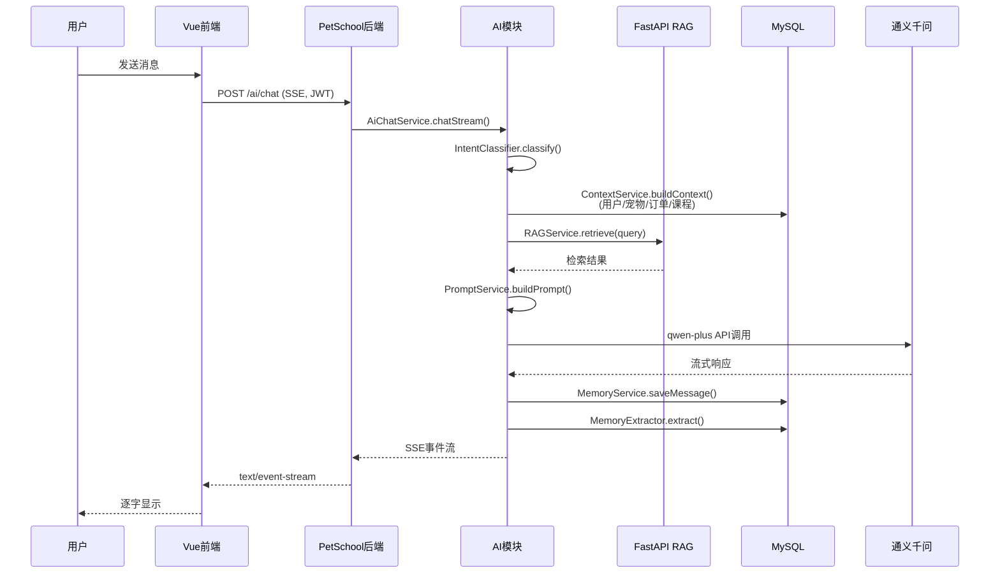
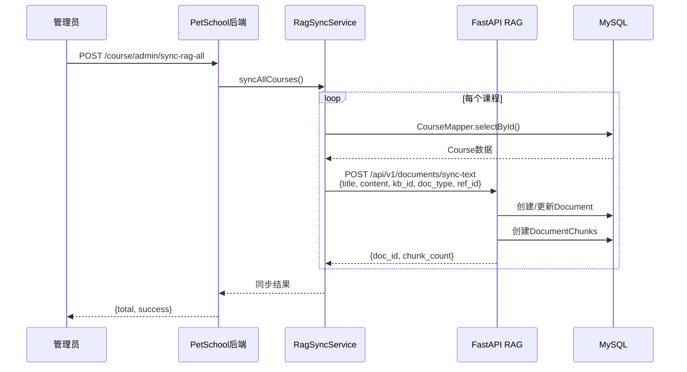
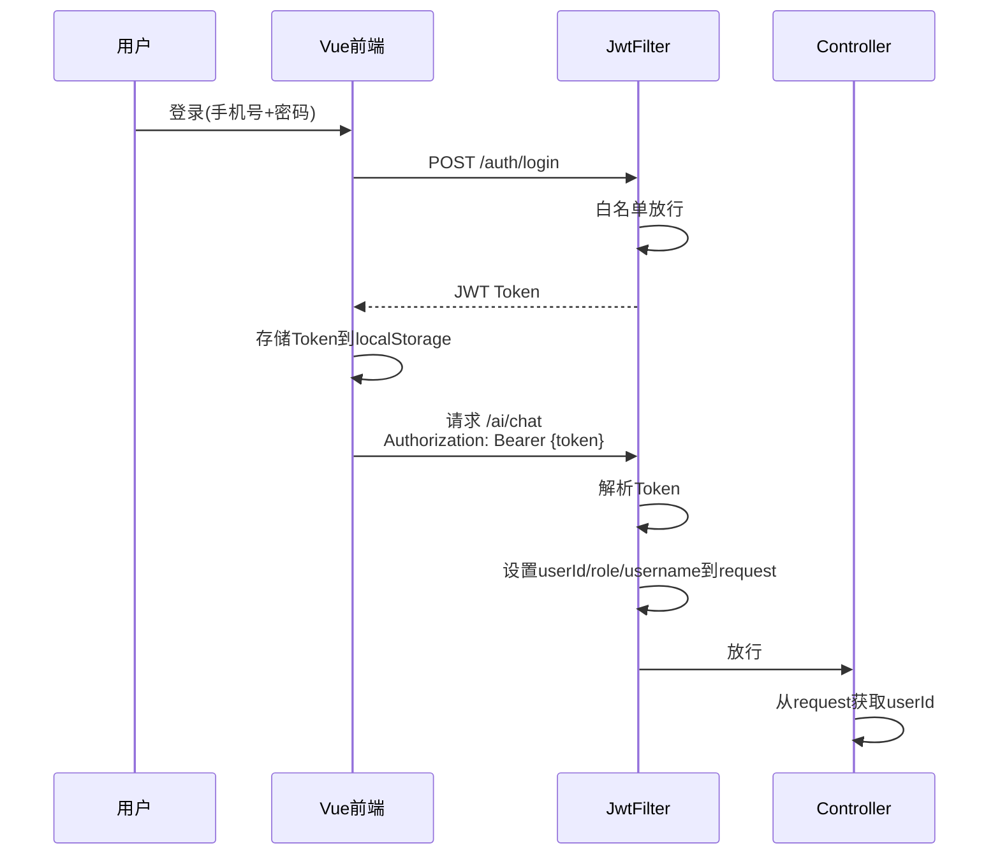
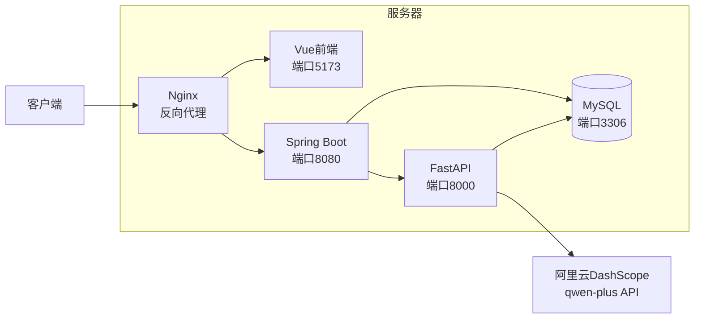

# PetSchool 系统架构图

## 整体架构

```mermaid
graph TB
    subgraph 客户端
        Web[PetSchool Vue前端<br/>端口5173]
    end

    subgraph PetSchool后端<br/>Spring Boot 端口8080
        Auth[认证模块<br/>JWT Auth]
        Course[课程模块<br/>CourseController]
        Order[订单模块<br/>PetOrderController]
        Pet[宠物模块<br/>PetController]
        User[用户模块<br/>UserController]

        subgraph AI模块
            AiChat[AI聊天控制器<br/>AiController]
            Intent[意图识别<br/>IntentClassifierImpl]
            Context[上下文构建<br/>ContextServiceImpl]
            Memory[记忆管理<br/>MemoryServiceImpl]
            RAGClient[RAG客户端<br/>RAGServiceImpl]
            Prompt[提示词工程<br/>PromptServiceImpl]
            Router[智能路由<br/>RouterServiceImpl]
            RagSync[RAG同步器<br/>RagSyncServiceImpl]
        end
    end

    subgraph AI引擎服务<br/>FastAPI 端口8000
        SyncText[文档同步<br/>/api/v1/documents/sync-text]
        Retrieval[向量检索<br/>/api/v1/retrieval]
        Embedding[Embedding<br/>BGE-M3]
        FAISS[FAISS向量库]
    end

    subgraph 数据层
        MySQL[(MySQL<br/>pet_school库)]
        LLM[通义千问<br/>qwen-plus]
    end

    Web -->|HTTP/JWT| Auth
    Web -->|HTTP/JWT| Course
    Web -->|HTTP/JWT| Order
    Web -->|HTTP/JWT| Pet
    Web -->|SSE/JWT| AiChat

    AiChat --> Intent
    Intent --> Router
    Router --> Context
    Router --> RAGClient
    Router --> Memory
    Router --> Prompt

    Context -->|MyBatis| MySQL
    Memory -->|MyBatis| MySQL
    AiChat -->|MyBatis| MySQL

    RAGClient -->|HTTP| Retrieval
    RagSync -->|HTTP| SyncText

    Retrieval --> Embedding
    Embedding --> FAISS
    SyncText --> MySQL

    Prompt -->|HTTP| LLM
```

## 数据流架构



## RAG同步架构



## JWT认证流程



## 部署架构


