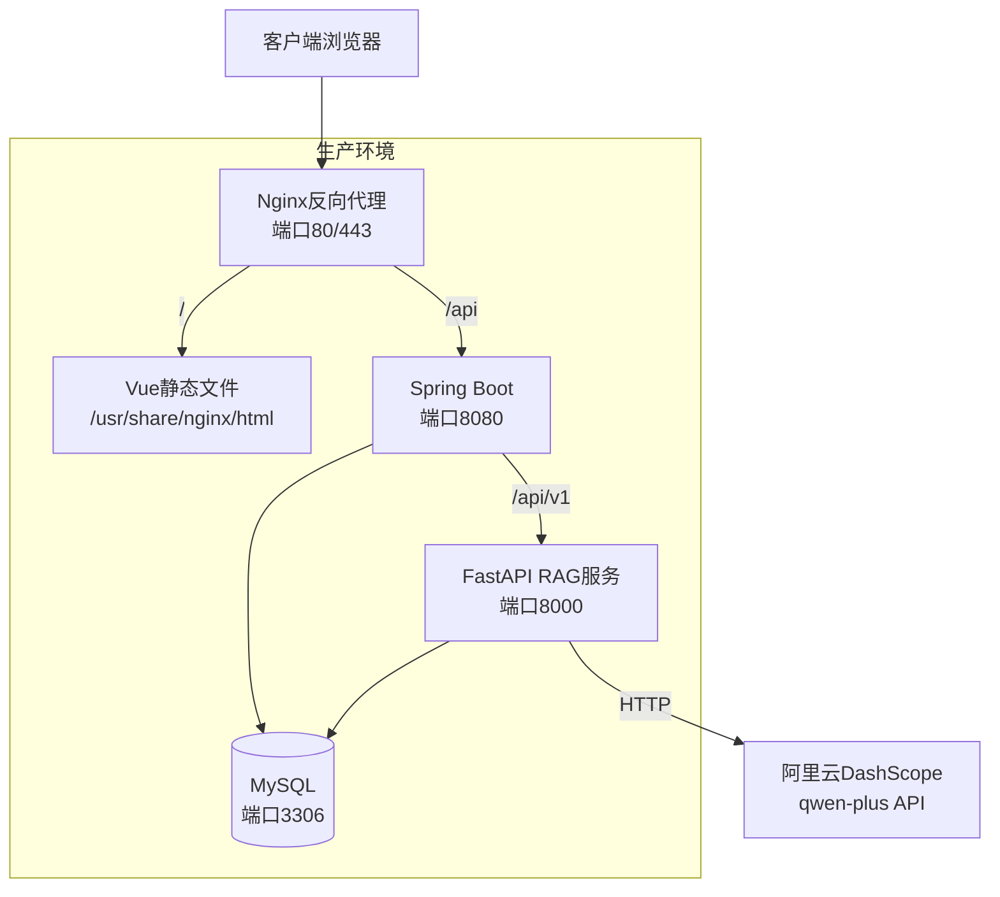

# PetSchool AI客服模块 - 统一接口与部署方案

## 1. 统一接口

### POST /api/ai/chat（SSE流式）

**请求：**
```json
{
  "message": "有什么训练课程？",
  "sessionId": 1
}
```

**请求头：**
```
Authorization: Bearer {jwt_token}
Content-Type: application/json
```

**响应（SSE流）：**
```
data: {"content":"您好！","sessionId":1,"intentType":"Course"}
data: {"content":"PetSchool提供以下课程...","sessionId":1}
data: [DONE]
```

### POST /api/ai/chat/sync（同步）

**请求：** 同上

**响应：**
```json
{
  "code": 200,
  "data": {
    "content": "PetSchool提供以下课程...",
    "sessionId": 1,
    "intentType": "Course"
  }
}
```

## 2. 辅助接口

| 方法 | 路径 | 描述 |
|------|------|------|
| GET | /ai/sessions | 获取会话列表 |
| GET | /ai/sessions/{id}/messages | 获取会话消息 |
| DELETE | /ai/sessions/{id} | 删除会话 |
| GET | /ai/memory | 获取用户记忆 |
| POST | /course/admin/sync-rag/{id} | 同步课程到RAG |
| POST | /course/admin/sync-rag-all | 同步所有课程到RAG |

## 3. 部署架构



## 4. 部署步骤

### 4.1 数据库

```bash
# 创建AI模块数据表
mysql -u root -p pet_school < src/main/resources/sql/migration_v2_ai_module.sql
```

### 4.2 Spring Boot后端

```bash
# 编译
cd pet-school
mvn clean package -DskipTests

# 运行
java -jar target/pet-school-1.0-SNAPSHOT.jar \
  --spring.datasource.url=jdbc:mysql://localhost:3306/pet_school \
  --spring.datasource.password=your_password \
  --ai.api-key=sk-xxx \
  --ai.base-url=https://dashscope.aliyuncs.com/compatible-mode/v1 \
  --ai.rag-base-url=http://localhost:8000
```

### 4.3 FastAPI RAG服务

```bash
# 安装依赖
cd backend
pip install -r requirements.txt

# 运行
uvicorn app.main:app --host 0.0.0.0 --port 8000
```

### 4.4 Vue前端

```bash
# 构建
cd pet-school-ui
npm run build

# dist目录部署到Nginx
cp -r dist/* /usr/share/nginx/html/
```

### 4.5 Nginx配置

```nginx
server {
    listen 80;
    server_name petschool.example.com;

    # 前端静态文件
    location / {
        root /usr/share/nginx/html;
        try_files $uri $uri/ /index.html;
    }

    # Spring Boot API代理
    location /api/ {
        proxy_pass http://localhost:8080/;
        proxy_set_header Host $host;
        proxy_set_header X-Real-IP $remote_addr;

        # SSE支持
        proxy_buffering off;
        proxy_cache off;
        proxy_read_timeout 300s;
    }
}
```

## 5. 环境变量

| 变量 | 描述 | 默认值 |
|------|------|--------|
| AI_API_KEY | 通义千问API Key | - |
| AI_BASE_URL | LLM API地址 | https://dashscope.aliyuncs.com/compatible-mode/v1 |
| AI_MODEL_NAME | 模型名称 | qwen-plus |
| AI_RAG_BASE_URL | FastAPI RAG服务地址 | http://localhost:8000 |
| JWT_SECRET | JWT密钥 | PetSchoolSecretKey2026ForJwtTokenGeneration!! |
| DB_URL | 数据库连接 | jdbc:mysql://localhost:3306/pet_school |

## 6. 验证清单

- [ ] 数据库AI表已创建（ai_chat_session, ai_chat_message, ai_memory_profile）
- [ ] Spring Boot启动成功，/ai/chat 接口可访问
- [ ] FastAPI启动成功，/api/v1/documents/sync-text 接口可访问
- [ ] JWT认证正常，未登录返回401
- [ ] AI聊天功能正常（8种意图识别）
- [ ] RAG同步正常（课程→知识库）
- [ ] 前端悬浮客服显示正常
- [ ] 后台AI管理页面可访问

## 7. 渐进式改造保证

1. **不影响现有业务**: AI模块作为独立包com.petschool.ai，不修改已有Controller/Service
2. **SQL脚本幂等**: 所有CREATE TABLE使用IF NOT EXISTS
3. **向量索引异步**: sync-text只做数据库同步，FAISS索引按需构建
4. **JWT复用**: AI接口使用PetSchool现有JWT认证体系
5. **数据源统一**: AI模块直接使用PetSchool Mapper，不创建独立数据源
