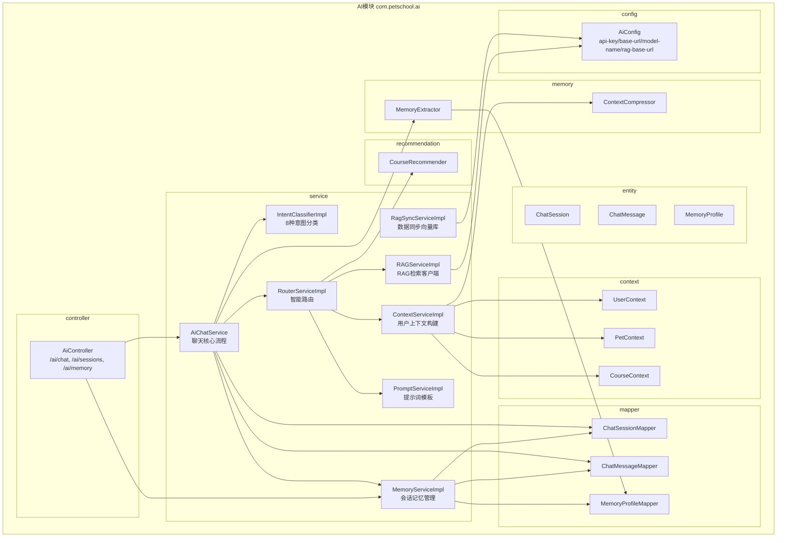
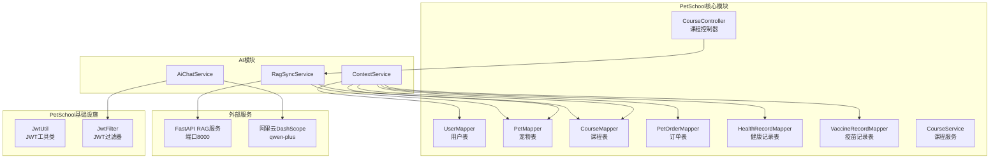
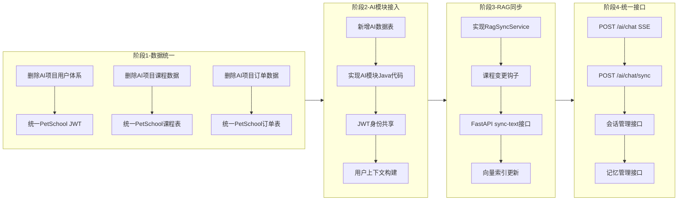

# PetSchool 模块依赖图

## AI模块内部依赖

## AI模块与PetSchool核心模块的依赖

## 渐进式改造说明

## 改造原则

1. **不影响现有业务**: AI模块作为独立包(com.petschool.ai)，不修改任何已有Controller/Service
2. **渐进式接入**: 通过Spring依赖注入，AI模块按需加载
3. **JWT统一认证**: 复用PetSchool JwtFilter，AI接口自动受保护
4. **数据源统一**: AI模块直接使用PetSchool Mapper，不创建独立数据源
5. **RAG异步同步**: 课程变更通过HTTP调用FastAPI，不阻塞主流程
